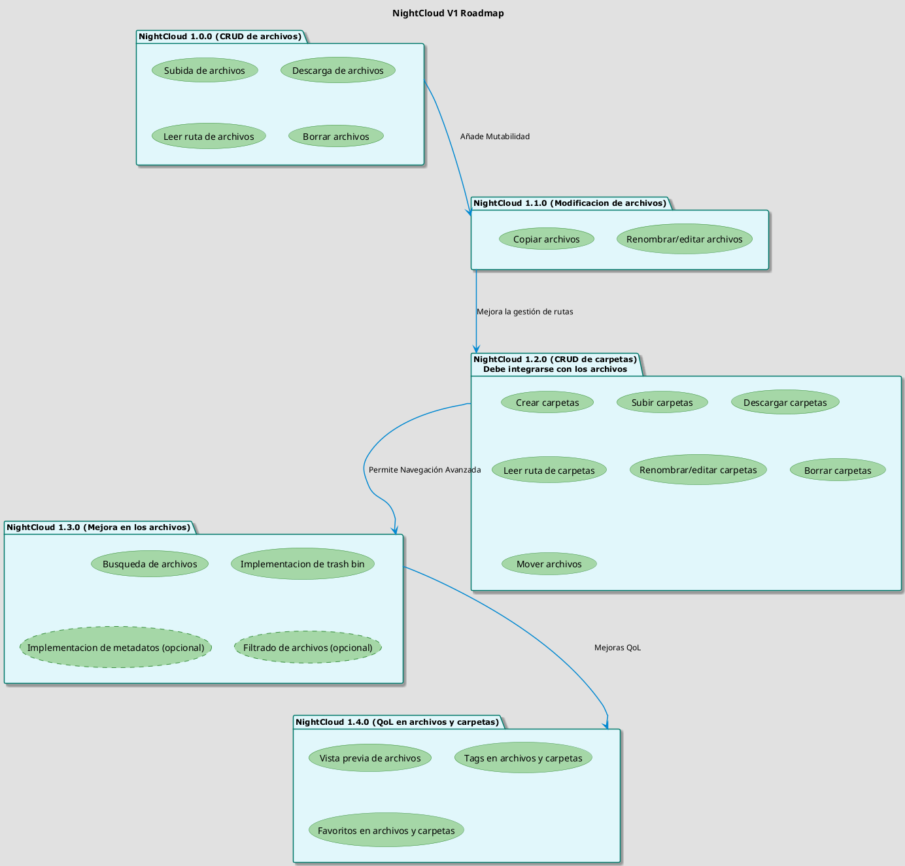
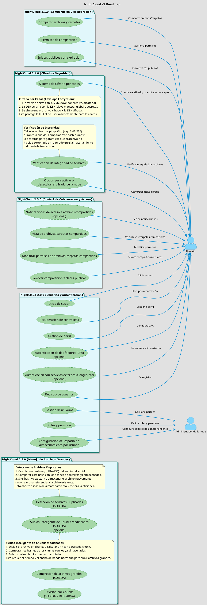
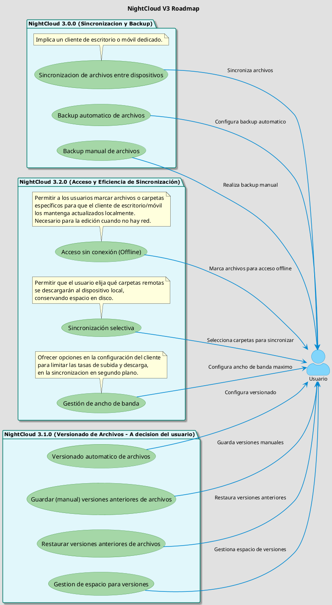

# 🧩 Nightcloud – Functional Roadmap

This document describes the planned evolution of **Nightcloud** through
**versioned, use-case–driven diagrams**.

Instead of defining strict timelines or delivery dates, the roadmap focuses on
**functional milestones**, showing how core capabilities are expected to grow
incrementally across versions.

All roadmap items are **subject to change** as the project evolves.

> ⚠️ Note:  
> The roadmap diagrams are currently written **in Spanish** and represent
> conceptual and functional intent rather than final implementations.

---

## 📦 Version 1.x — Core File Management

The first phase focuses on establishing the **foundation of file and folder
management**, defining the basic capabilities required for a functional local
cloud.

Key areas include:
- File upload, download, and deletion
- Path handling
- Folder management
- Basic quality-of-life improvements
- Search, trash bin, and metadata (optional)

---

## 👥 Version 2.x — Users, Collaboration, and Security

This phase introduces **multi-user support**, collaboration features, and
security-related capabilities required for shared and organizational use.

Key areas include:
- User registration and authentication
- Roles and permissions
- File and folder sharing
- Public links with expiration
- Large file handling (chunking, compression)
- Encryption and integrity verification
- Optional advanced security features (2FA, external auth)

---

## 🔄 Version 3.x — Synchronization and Backup

The third phase focuses on **data continuity and multi-device usage**, enabling
synchronization, backups, and efficient access patterns.

Key areas include:
- File synchronization across devices
- Automatic and manual backups
- File versioning (user-controlled)
- Offline access
- Selective sync and bandwidth management

This phase implies the introduction of **dedicated client applications**
(desktop and/or mobile).

---

## 🧠 Notes

- This roadmap reflects **planned functionality**, not guaranteed delivery.
- Features may be added, removed, or reorganized at any time.
- Optional features are explicitly marked in the diagrams.
- Technical implementation details may differ from the conceptual design.

---

## 📌 Disclaimer

This roadmap is provided for **documentation and transparency purposes only**  
and does not constitute a commitment or guarantee of future features.
